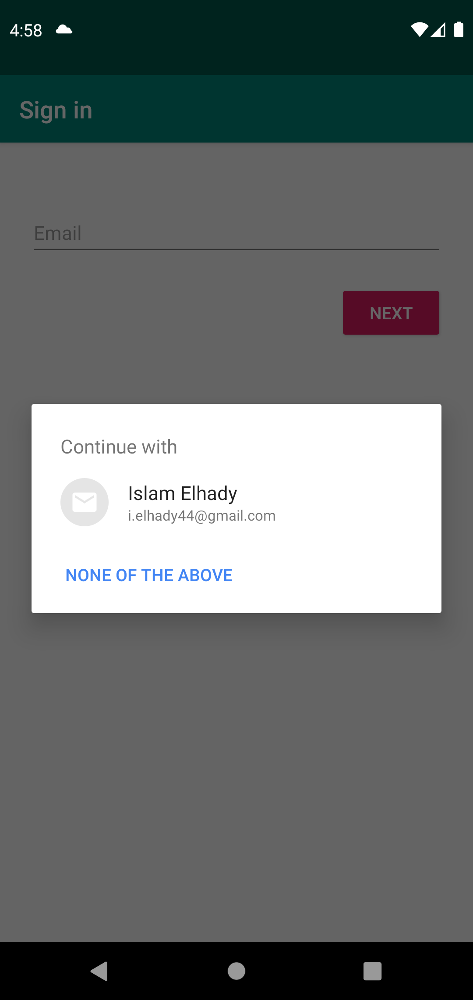

# Location Reminder
Location Reminder is a TO-DO list app with location reminders that remind the user to do something when the user is at a specific location. The app will require the user to create an account and login to set and access reminders.

## Features
- MVVM Architecture
- Firebase Authentication
- Google Maps API
- Geofencing API
- UI and Unit Testing

## Libraries
- RecyclerView
- Navigation Component
- Firebase Auth
- ViewModel
- LiveData
- Room
- Material Design 
- Databinding
- Coroutines
- Mockito

## Screenshots
<h4 align="center">

